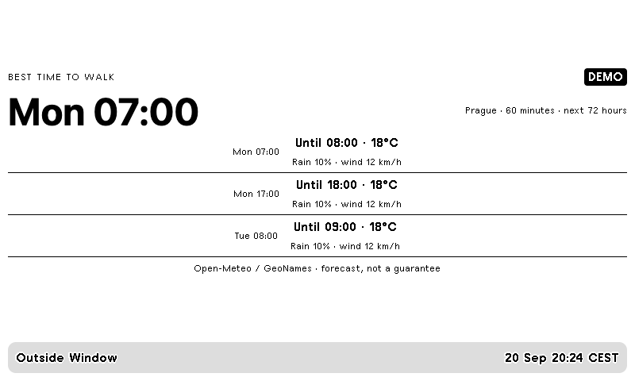

# Outside Window

Outdoor activity windows from a city weather forecast. A standalone, MIT-licensed TRMNL plugin with four layouts and a
local Python collector. This repository contains everything needed to run it;
no other plugin repository or developer-operated service is required.

[Download](https://github.com/JirakJ/trmnl-outside-window/releases/latest) · [Configuration](docs/CONFIGURATION.md) · [Scheduling](docs/RUNNING.md)



## Install

Requires Python 3.11+ and TRMNL Private Plugin access. Run the following from your
computer or always-on server; the shell examples use macOS/Linux paths.

```sh
git clone https://github.com/JirakJ/trmnl-outside-window.git
cd trmnl-outside-window
python3 -m venv .venv
.venv/bin/pip install -r requirements.lock -e .
mkdir -p private
chmod 700 private
cp config.example.json private/config.json
.venv/bin/python -m trmnl_outside_window --demo
```

Edit `private/config.json` using the [plugin-specific instructions](docs/CONFIGURATION.md).
Then collect your data locally:

```sh
.venv/bin/python -m trmnl_outside_window --config private/config.json
```

1. Download `trmnl-outside-window.zip` from this repository's releases.
2. In TRMNL, open **Plugins → Private Plugin → Import new** and import the ZIP.
3. Set `TRMNL_WEBHOOK_URL` in your local environment to that plugin's webhook URL.
   Keep it private, like a password.
4. Add `--push` to the collection command to send your screen to TRMNL.
5. Schedule the command every 15 minutes; see [running and scheduling](docs/RUNNING.md).

The installed command `trmnl-outside-window` accepts the same options. Without `--push`, only
local JSON is printed. `--demo` uses synthetic data and cannot be pushed. Normal
source failures preserve the previous screen; always check its update timestamp.

## Development and verification

```sh
.venv/bin/python -m unittest discover -s tests -v
bundle install
.venv/bin/python scripts/build.py
npm ci
npx playwright install chromium
npm run check:layouts
```

Ruby 4.0+ is required by the pinned official preview tool. `bundle exec trmnlp serve`
runs the preview from this repository's root after the build. The build creates
`dist/trmnl-outside-window.zip`; it contains only `settings.yml` and the five Liquid templates.
No credentials, source data or demo events are included. The four layouts target
the original 800×480 display, including its half-screen and quadrant views.

GitHub Actions independently installs this repository, runs its regression tests,
builds the ZIP and checks all four layouts in Chromium. Dynamic text is escaped,
redirects are refused, and webhook payloads are limited to 2000 bytes.


Physical TRMNL display operation, account import and your private data sources have
not been verified. See the configuration guide for supported source integrations.
TRMNL Recipe catalog publication and Creator Fund eligibility are separate processes.

## Source and privacy

Extracted from [TRMNL Everyday](https://github.com/JirakJ/trmnl-everyday/tree/7f754ff963ca7c01a658684e56a8553ee46af1dc)
into an independently maintained repository. The original MIT copyright is retained.
There is no telemetry. Your data providers receive their necessary requests and
TRMNL receives the screen payload. Keep `private/`, real previews and credentials
out of public issues. Source-code licensing does not replace provider data terms.
This project is independent of TRMNL.
